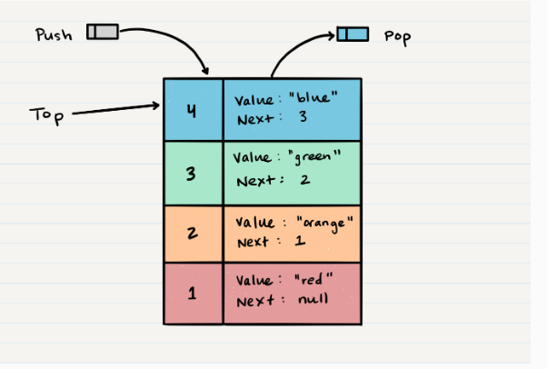
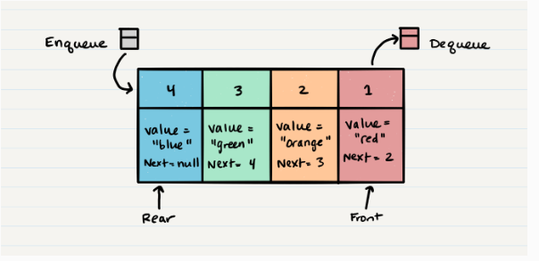

## Use an analogy

## what is satck  & Queuse : 

A stack is a data structure that consists of nodes  each nodes  references the next Node in

a queue is a linear data structure that follows the First-In-First-Out (FIFO) principle. This means that the element that is added first to the queue will be the first one to be removed. 

## why we use stack & queuse :
 

 we use stack:

 1. Managing function calls and return addresses in programming languages.

2. Implementing undo functionality in applications.
3. Handling browser history.

we use Queuse :

1. Managing tasks in a print spooler
2. Implementing breadth-first search in graph algorithms.
3. Buffering data in asynchronous systems

4. games 

## how is  the structure for stack and Queuse: 

1. stack :A stack has a simple structure where elements are organized in a linear manner, and only two operations are allowed: push (adding an element to the top) and pop (removing the top element). The last element added (the top element) is the first to be removed (Last-In-First-Out, or LIFO).

2. Queue:A queue also has a linear structure, but it follows the First-In-First-Out (FIFO) principle. Elements are added at the rear (enqueue), and they are removed from the front (dequeue).

## Stack Visualization:

## Queue Visualization: 

